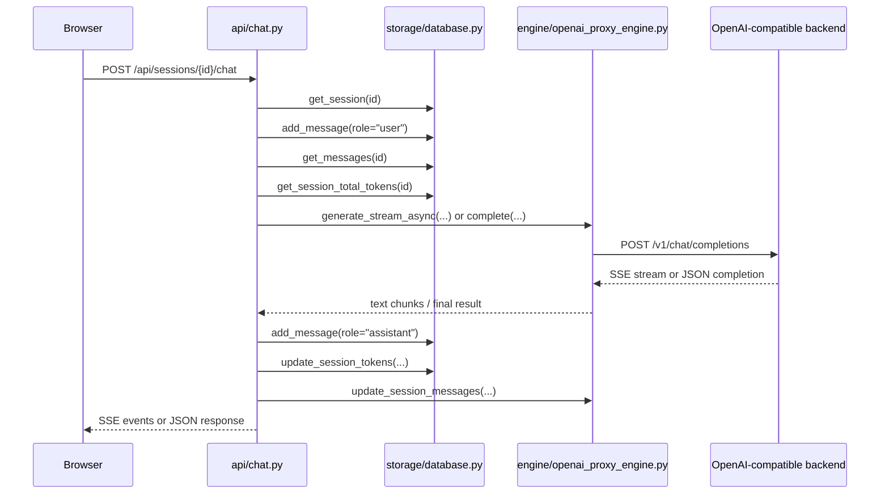

# SoloHeaven Chat Flow

## Browser chat flow (`/api/sessions/{id}/chat`)

This is the path used by the built-in web UI.

## Browser streaming details

### Request construction

`src/mlx_soloheaven/web/app.js` sends:

- `POST /api/sessions/{currentSessionId}/chat`
- JSON body: `{ content, stream: true, model: selectedModel }`

### Server-side steps

`src/mlx_soloheaven/api/chat.py`:

1. Validates session exists
2. Stores the user message in SQLite
3. Rebuilds prompt messages from:
   - session system prompt
   - persisted message history
4. Checks `context_window_limit` usage
5. Auto-triggers compaction at 90 percent utilization
6. Selects the engine by model name/alias
7. Starts SSE streaming via `_stream_chat(...)`

### Streaming event shapes from `/api/.../chat`

The browser chat endpoint emits custom SSE payloads:

- `start`
  - session/cache metadata
- `queued`
  - emitted if the engine lock is already held
- `text`
  - incremental text chunk plus live TPS value
- `done`
  - final thinking/content split and stats

These are not OpenAI SSE chunks; they are app-specific events consumed only by `web/app.js`.

## OpenAI-compatible flow (`/v1/chat/completions`)

`src/mlx_soloheaven/api/openai_compat.py` handles standard API clients.

### Non-streaming

1. Convert Pydantic messages to plain dicts
2. Strip explicit thinking tags before upstream call
3. Map OpenAI-ish penalties into local repetition penalty
4. Call `engine.complete(...)`
5. Rebuild OpenAI-compatible response shape
6. If `user` is set, update local session history in memory

### Streaming

1. Emit assistant-role bootstrap chunk
2. Optionally inject initial `<think>` token if enabled
3. Consume `engine.generate_stream_async(...)`
4. Translate accumulated text into OpenAI SSE chunks
5. Detect buffered `<tool_call>` blocks and convert to OpenAI tool-call deltas
6. Emit final usage chunk and `[DONE]`

## Engine behavior

`src/mlx_soloheaven/engine/openai_proxy_engine.py` is the real execution core for this branch.

### What it does

- Normalizes upstream base URL to `/v1`
- Adds `Authorization: Bearer <key>` headers
- Builds request payloads for chat completions
- Uses `httpx.Client` for sync completions
- Uses `httpx.AsyncClient.stream(...)` for streaming completions
- Buffers streaming tool-call fragments until they can be emitted coherently

### Local session state

The engine also keeps lightweight in-memory state:

- `_sessions`: last message history by session ID
- `_base_caches`: reserved for cache stats/introspection hooks
- `supports_prefix_cache = False`

This is not a real tensor cache in the current branch. It is local metadata for session continuity and admin visibility.

## Compaction flow

Compaction exists in two places:

- automatic trigger in `api/chat.py`
- manual trigger in `api/compaction.py`

The implementation in `engine/compaction.py`:

1. estimates token count crudely by character length
2. keeps the most recent N turns
3. summarizes older turns by asking the upstream backend for a summary
4. records compaction history in SQLite

Important limitation:

- `database.update_session_compacted_state(...)` is a stub, so compaction is recorded and token totals are updated, but persisted message history is not fully rewritten yet.

## Settings flow caveat

The chat layer tries to read these per-session fields before calling the engine:

- `temperature`
- `top_p`
- `min_p`
- `top_k`
- `repetition_penalty`
- `thinking_budget`
- `max_tokens`

But the schema shown in `storage/database.py` only clearly persists a subset of them. That means some settings are wired at the API layer more completely than they are represented in the current database schema.

## Frontend/backend contract

The browser UI depends on these contracts:

- `/api/sessions` for sidebar CRUD
- `/api/sessions/{id}/messages` for history reload
- `/api/sessions/{id}/chat` for SSE streaming
- `/api/sessions/{id}/settings` for per-session controls
- `/v1/models` for model dropdown population
- `/api/cache/stats` for session/backend summary

If any of those change, `src/mlx_soloheaven/web/app.js` must be updated in lockstep.
