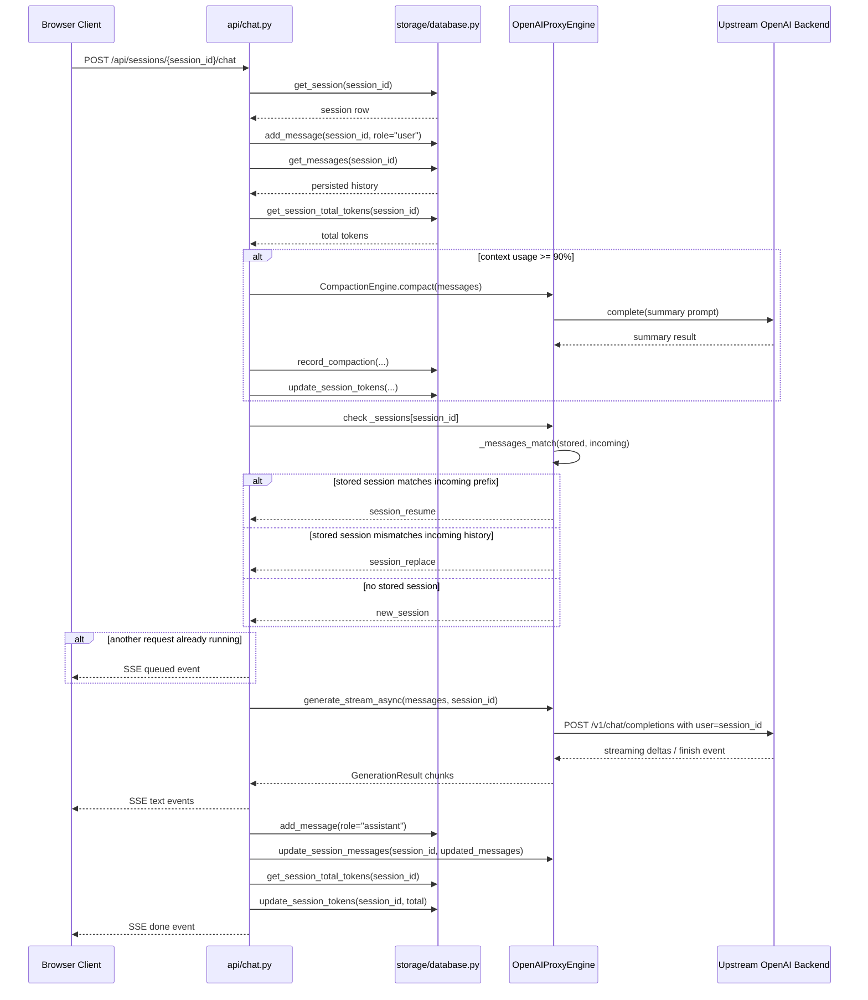

# KV cache mismatch 방지 로직

## 먼저 전제부터

현재 `ubuntu-support` 브랜치는 로컬 MLX 추론 엔진처럼 실제 텐서 KV cache를 재사용하는 구조가 아니다. 대신 `OpenAIProxyEngine`이 상위 OpenAI 호환 백엔드로 요청을 프록시하고, 로컬에서는 세션 메시지 히스토리와 상태 메타데이터를 관리한다.

즉 여기서 말하는 "KV cache mismatch 방지"는 실제로는 아래 두 가지를 뜻한다.

1. 클라이언트가 기대하는 대화 문맥과 서버가 기억하는 세션 히스토리가 어긋나지 않게 하는 것
2. 서버 메모리 상태와 SQLite 영속 상태가 어긋날 때 안전하게 덮어쓰거나 재구성하는 것

핵심 파일:

- `src/mlx_soloheaven/api/chat.py`
- `src/mlx_soloheaven/api/openai_compat.py`
- `src/mlx_soloheaven/engine/openai_proxy_engine.py`
- `src/mlx_soloheaven/storage/database.py`

## 실제 mismatch 방지 포인트

### 1. 세션 ID를 상위 백엔드까지 같이 전달한다

`OpenAIProxyEngine._build_payload()`는 `session_id`가 있으면 이를 상위 백엔드 payload의 `user` 필드에 넣는다.

의미:

- 로컬 서버 세션과 상위 백엔드 요청을 같은 식별자로 묶는다.
- 브라우저/API 클라이언트가 다른 세션과 문맥이 섞이는 위험을 줄인다.

관련 코드:

- `src/mlx_soloheaven/engine/openai_proxy_engine.py:169`
- `src/mlx_soloheaven/engine/openai_proxy_engine.py:204`

### 2. 채팅 시작 전에 항상 DB 기준으로 메시지를 다시 조립한다

`api/chat.py`는 요청을 받으면 먼저 사용자 메시지를 DB에 저장한 뒤, 그 세션의 전체 메시지 히스토리를 `db.get_messages(session_id)`로 다시 읽어서 프롬프트를 재구성한다.

의미:

- 브라우저가 들고 있는 화면 상태를 그대로 믿지 않는다.
- 서버 메모리보다 SQLite 영속 상태를 우선해 프롬프트를 다시 만든다.
- 중간에 새로고침, 재접속, 서버 재기동이 있어도 세션 문맥을 복구할 수 있다.

관련 코드:

- `src/mlx_soloheaven/api/chat.py:114`
- `src/mlx_soloheaven/api/chat.py:123`

### 3. 메모리 세션 상태와 incoming 메시지를 prefix 비교한다

`OpenAIProxyEngine._messages_match(stored, incoming)`는 서버 메모리에 들고 있던 세션 메시지와 새 요청의 메시지 리스트를 앞에서부터 비교한다.

비교 기준:

- `role`이 같은지
- `content`를 텍스트로 풀었을 때 같은지
- incoming 길이가 stored보다 짧으면 즉시 불일치 처리

의미:

- 세션이 같은 이름을 쓰더라도 대화 내용이 달라졌으면 재사용으로 간주하지 않는다.
- "같은 session_id인데 다른 대화" 같은 위험한 상황을 `session_replace`로 떨어뜨린다.

관련 코드:

- `src/mlx_soloheaven/engine/openai_proxy_engine.py:127`

### 4. 불일치가 감지되면 재사용 대신 교체로 처리한다

`api/chat.py::_stream_chat()`에서 메모리 세션이 있으면 `_messages_match(...)`를 먼저 확인한다.

가능한 상태:

- `cache_hit`: 현재 브랜치에서는 사실상 비활성 상태 (`supports_prefix_cache = False`)
- `session_resume`: 히스토리는 이어지지만 실제 프롬프트 캐시는 상위 백엔드가 알아서 처리
- `session_replace`: 저장된 세션 메시지와 새 incoming 메시지가 다르므로 교체 필요

이 중 mismatch 방지의 핵심은 `session_replace`다.

관련 코드:

- `src/mlx_soloheaven/api/chat.py:240`
- `src/mlx_soloheaven/api/chat.py:248`
- `src/mlx_soloheaven/api/chat.py:266`

### 5. 응답이 끝나면 서버 메모리 세션을 새 히스토리로 덮어쓴다

응답이 끝난 뒤 `chat.py`는 assistant 메시지를 DB에 저장하고, 이어서 `eng.update_session_messages(session_id, updated_messages)`를 호출한다.

의미:

- DB에 실제로 저장된 user/assistant 흐름을 기준으로 메모리 상태를 다시 동기화한다.
- 이전에 메모리에 있던 오래된 세션 히스토리를 그대로 남겨두지 않는다.

관련 코드:

- `src/mlx_soloheaven/api/chat.py:354`
- `src/mlx_soloheaven/api/chat.py:364`
- `src/mlx_soloheaven/engine/openai_proxy_engine.py:422`

### 6. 동시 요청 충돌은 전역 lock + queued 이벤트로 완화한다

`OpenAIProxyEngine`은 `_lock`을 가지고 있고, 실제 동기 completion은 `with self._lock` 안에서 수행된다. 스트리밍 경로에서도 `chat.py`는 시작 전에 `eng._lock.locked()`를 보고 이미 다른 요청이 진행 중이면 `queued` 이벤트를 브라우저로 보낸다.

의미:

- 같은 엔진에서 여러 요청이 동시에 상태를 꼬이게 만드는 상황을 줄인다.
- 클라이언트는 조용히 멈춘 것처럼 보지 않고 "대기 중" 상태를 인지할 수 있다.

관련 코드:

- `src/mlx_soloheaven/engine/openai_proxy_engine.py:91`
- `src/mlx_soloheaven/engine/openai_proxy_engine.py:288`
- `src/mlx_soloheaven/api/chat.py:279`

### 7. 컨텍스트가 너무 커지면 자동 compaction으로 붕괴를 늦춘다

`chat.py`는 세션 총 토큰 수와 `context_window_limit`를 비교해서 90% 이상이면 자동 compaction을 수행한다.

의미:

- mismatch 자체를 직접 막는 로직은 아니지만, 너무 긴 히스토리 때문에 문맥이 잘리거나 상위 백엔드 처리 방식이 흔들리는 상황을 미리 줄인다.
- 다만 현재 브랜치에서는 compaction 후 영속 메시지를 완전히 재작성하지는 않아서, 방지 로직이라기보다 완충 장치에 가깝다.

관련 코드:

- `src/mlx_soloheaven/api/chat.py:135`
- `src/mlx_soloheaven/api/chat.py:140`
- `src/mlx_soloheaven/storage/database.py:397`

## 이 브랜치에서 실제로 없는 것

아래는 이름만 비슷하고 실제로는 없는 것들이다.

- 로컬 텐서 KV cache 재사용
- prefix cache hit 기반 suffix-only 재생성
- disk cache reload
- base cache materialization

증거:

- `supports_prefix_cache = False`
- `NullCacheManager`
- `_has_disk_cache()`는 항상 `False`
- `_load_session_from_disk()`는 항상 `None`

즉, 현재 브랜치의 "cache mismatch 방지"는 텐서 캐시 무결성보다 세션 히스토리 정합성 유지에 가깝다.

## client-server sequence diagram

## 정리

현재 브랜치의 mismatch 방지 전략은 "DB를 기준으로 매 요청마다 히스토리를 재구성하고, 메모리 세션과 incoming 메시지를 prefix 비교해서 다르면 재사용하지 않는다"로 요약할 수 있다.

즉, 진짜 KV cache 무결성 로직이라기보다 다음 원칙의 조합이다.

- session_id를 끝까지 유지한다
- 요청 전에는 DB 기준으로 히스토리를 재구성한다
- 메모리 세션이 들어맞는지 prefix 비교한다
- 다르면 교체하고, 맞으면 이어간다
- 응답 후에는 DB와 메모리 상태를 다시 동기화한다
- 동시에 여러 요청이 꼬이지 않도록 lock과 queued 신호를 사용한다
